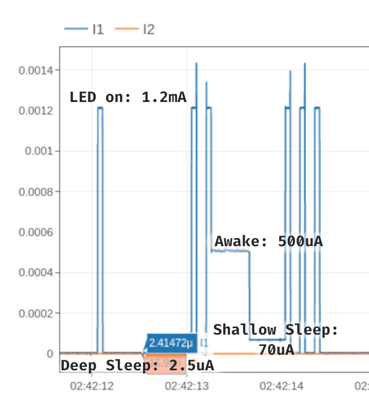

# Cathodic Protection Monitoring - Firmware

#### Janet Vorobyeva

This repo contains the firmware for my Cathodic Protection Monitoring project, as part of [CSE237D](https://kastner.ucsd.edu/ryan/cse-237d-embedded-system-design/), Embedded System Design.

The goal of the project was to develop an energy-harvesting sensor node to monitor the health of a 
[cathodic protection](https://en.wikipedia.org/wiki/Cathodic_protection) system. This sensor
can sustain itself on a trickle of power (<250 uW), and so can run directly
from the electric potential it's designed to measure. It transmits measurements several times a day
over a LoRa radio, (range of up to 5-15km, depending on conditions)

This work was inspired by the paper: 
> [Repurposing Cathodic Protection Systems as Reliable, in-situ, Ambient Batteries for Sensor Networks](https://dl.acm.org/doi/10.1145/3412382.3458277)

### Microcontroller Current Draw

# Repo Organization

This repo contains firmware for both the sensor node and a LoRa gateway to bridge it to the internet.

### Sensor node (artemis-sensor)
- Sparkfun Artemis module (based on Ambiq Apollo3 microcontroller)
- ADP5091 Energy harvesting chip
- RFM95W LoRa module, for long-range radio transmission
- Designed to run on <250 microwatts input power, (tested working at 150 microwatts)
  and transmit several radio packets a day with voltage measurements.

Hardware is in a separate repo: [cpm-hardware](https://github.com/jvorob/cpm-hardware)

### LoRa Gateway 

To recieve measurements from the sensor, I've put together a 
Heltec AB02A LoRa node to recieve the packets and a 
nodemcu ESP32-S module (devboard around a ESP-WROOM-32 module) to send them via Wifi.
Together these to act as a gateway, uploading received LoRa packets to a [Grist](getgrist.com) document.

(this is a very quick-and-dirty solution, done as lazily as possible using whatever Arduino
libraries I could scrounge up for the purpose, and so should not be replicated by anyone)

