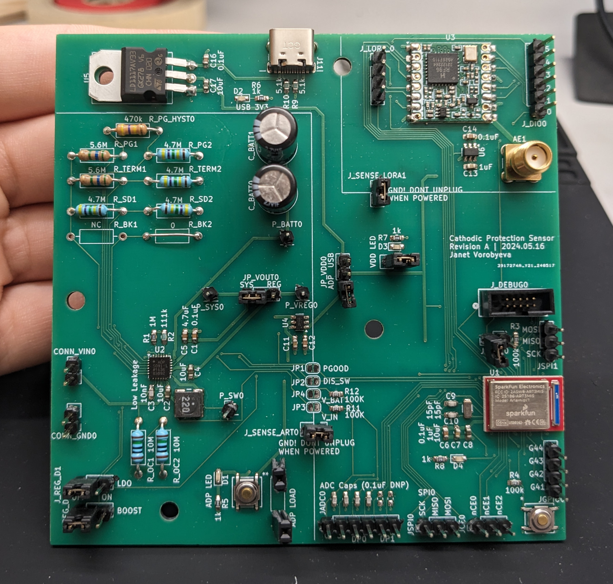

# Cathodic Protection Monitoring - Firmware

*Janet Vorobyeva*

This repo contains the firmware for my Cathodic Protection Monitoring project, as part of [CSE237D](https://kastner.ucsd.edu/ryan/cse-237d-embedded-system-design/), Embedded System Design.

The goal of the project was to prototype an energy-harvesting sensor node to monitor the health of a 
[cathodic protection](https://en.wikipedia.org/wiki/Cathodic_protection) system. This sensor
can sustain itself on a trickle of power (tested down to 150 uW), and so can run directly
from the electric potential it's designed to measure. It transmits measurements several times a day
over a [LoRa](https://en.wikipedia.org/wiki/LoRa) radio, (range of up to 5-15km, depending on conditions)

You can see the full details in this [writeup of the project](project_writeup.pdf)

### Hardware:
- [Sparkfun Artemis](https://www.sparkfun.com/artemis) module (based on Ambiq Apollo3 microcontroller)
- ADP5091 Energy harvesting chip
- RFM95W LoRa module, for long-range radio transmission

Electrical schematics are in this repo: [cpm-hardware](https://github.com/jvorob/cpm-hardware)

# Organization

`artemis-sensor/` contains the firmware for the main board.

`gateway/` contains firmware for my hacked-together LoRa-Wifi bridge, frankensteined together
from a Heltec AB02A LoRa node and a nodemcu-32S WiFi module (ESP32 devboard).
(this was quick-and-dirty solution, done as lazily as possible using whatever Arduino
libraries I could scrounge up for the purpose, and so should not be replicated by anyone)
[Grist](getgrist.com) document.

